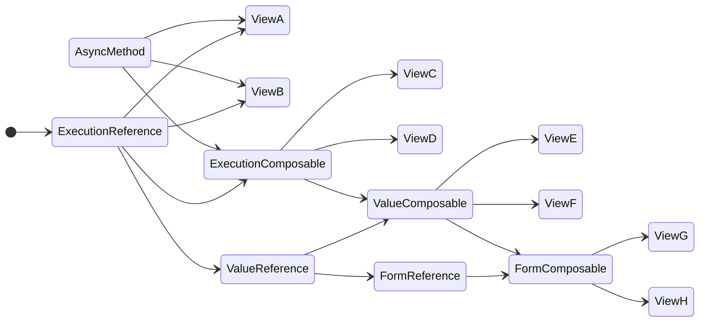
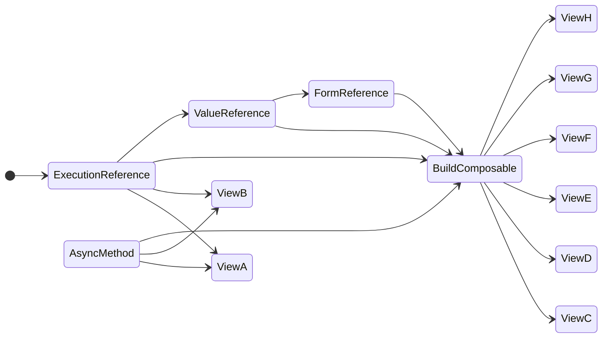
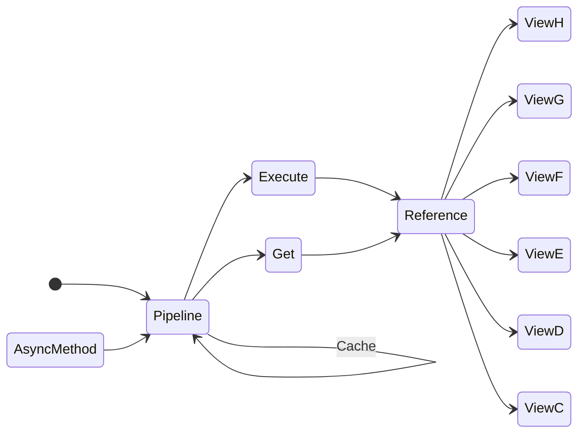

# The Goal

This library has two objectives:

1. To provide a simplified state machine for asynchronous methods in TypeScript.
2. To provide an easy to use structure to facilitate the developer experience of migrating to this libraries structure.

# Usage Structure

Current Structure

Future Structure

Final Structure

